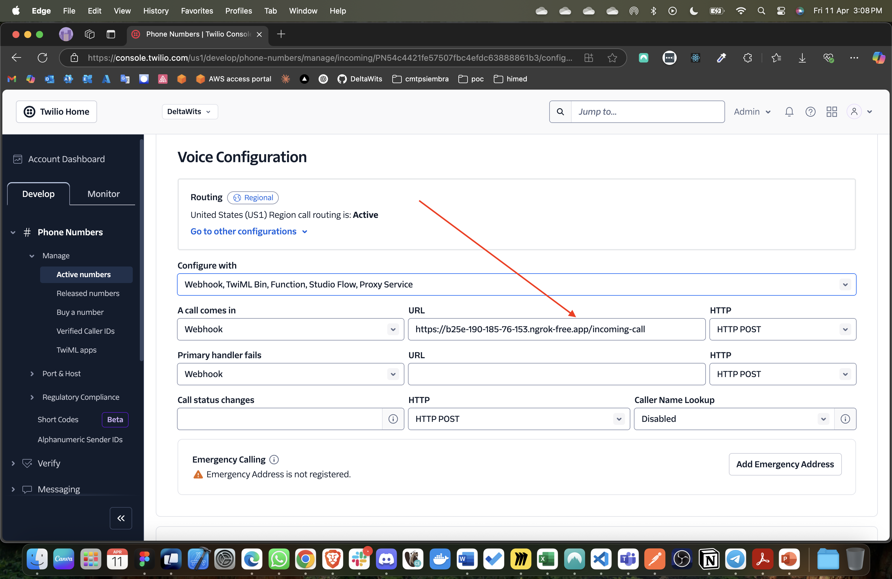

# Streaming Agent

## Install dependencies

```bash
pdm install
```

## Setup environment variables

```bash
cp .env.template .env
```

And fill the `.env` file with your OpenAI API key and other required environment variables.

## Run the server

```bash
python main.py
```

## Install NGROK

Follow instructions at https://ngrok.com/ and run the following command to expose your local server to the internet:

```bash
ngrok http 5050
```

Configure the HTTPS url in the active number: 
